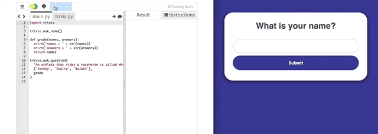

# Live Trivia

Interactive live trivia framework used to teach Python lists.



Inspired by [HQ](https://hqtrivia.com) and [TEALS](https://www.tealsk12.org/) 2nd Semester Introduction to Computer
Science [Lab 2.05](https://tealsk12.gitbook.io/intro-cs-2/unit2_md/lesson-4/lab).
Built with [Flask](http://flask.pocoo.org/docs/0.12/) and [PostgreSQL](https://www.postgresql.org/).

## Instructions

Create a series of three trivia questions to test your classmates!

You must use the following methods exposed by the `trivia` module:

### `ask_name()`

Prompts the user for their name in development mode.

### `ask_question(question, options, grade)`

Submits the specified _question_ with a possible list of answer _options_.

_grade_ is a callable method that is passed:

1. `names` – a list of submitted names
2. `answers` – a list of corresponding submitted answers

The method should return a list of names that correctly answered the question.

## Starter Code

Starter Python client code can be accessed via [trinket](https://trinket.io/python3/0ef2599c81) or [Repl.it](https://repl.it/@namoscato/Interactive-Trivia-Starter).

```python
import trivia

trivia.ask_name()

def grade(names, answers):
  print('names = ' + str(names))
  print('answers = ' + str(answers))
  return names

trivia.ask_question('An athlete that rides a racehorse is called what?', ['Jockey', 'Goalie', 'BoJack'], grade)
```

## Modes

### Development

A default development mode enables client development, without server interaction. In this mode a single user can
interact with the program via standard input.

### Interactive

When `INTERACTIVE_MODE=True`, the execution of the client Python program interacts with a light REST API hosted on
[Heroku](https://www.heroku.com/). A conventional game flow is as follows:

1. Participants navigate to [live-trivia.herokuapp.com](https://live-trivia.herokuapp.com/) and login
2. Designated host executes their client Python program
3. Participants respond to the submitted question
4. Host clicks <kbd>enter</kbd> to grade answers
5. Participants' screens change color accordingly
